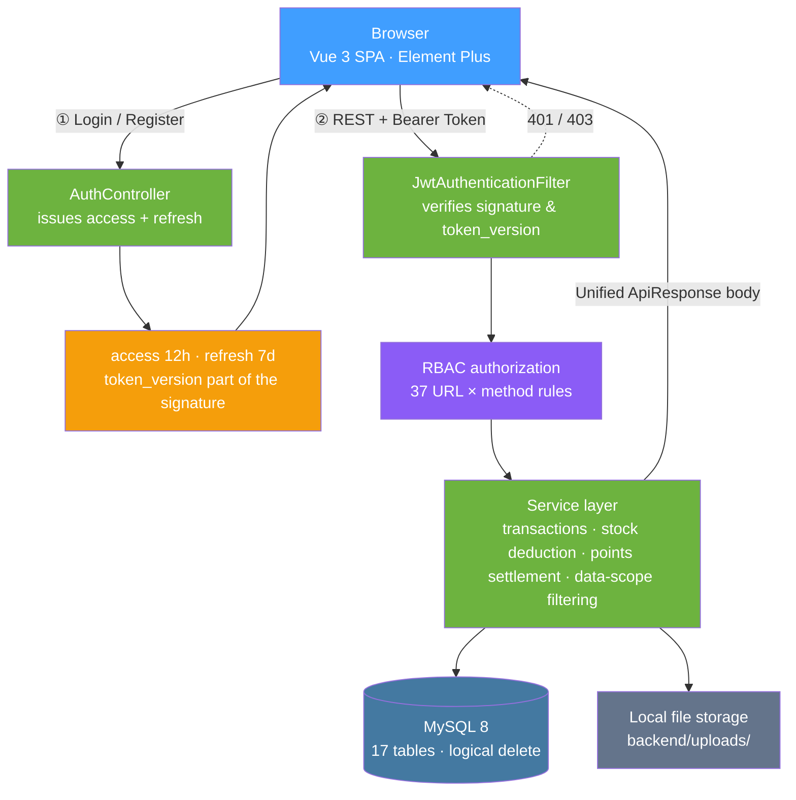

<p align="center"><a href="./README.md">简体中文</a> | <b>English</b></p>

<div align="center">

<picture>
  <source media="(prefers-color-scheme: dark)" srcset="./docs/images/logo-white.png" />
  
</picture>

# Cat Coffee Management System

**Cat Coffee Management System**

**A business management system for single-store cat cafés. Cats, drinks, tables, reservations, orders, and membership marketing all close the loop in one admin console — staff and customers see two views of the same data.**

This is not a CRUD collection with a new skin. What it sets out to prove is that **the same data holds up under two perspectives**: the store side cares about scheduling, inventory, and settlement, while the customer side cares about "my reservations, my orders, my points." So cat profiles, drink inventory, table resources, customer reservations, and order flows are wired into a chain that actually works end to end — reserve a table → order on arrival → deduct inventory → check out and earn points → redeem points for cash credit → review after consumption; and of the three roles — admin, staff, regular user — each can only see the segment of that chain they are allowed to see.

[Changelog](./CHANGELOG.md) &nbsp;·&nbsp; [Database script](./sql/cat_coffee.sql) &nbsp;·&nbsp; [API Contract](#api-contract) &nbsp;·&nbsp; [Disclaimer & Notes](#license)

[](backend/pom.xml)
[](frontend/package.json)
[](frontend/package.json)
[](sql/cat_coffee.sql)
[](#permission-model)
[](#testing)
[](#testing)

</div>

---

## Preview

<table>
<tr>
<td colspan="2" align="center"></td>
</tr>
<tr>
<td colspan="2" align="center"><sub><b>Login page</b> · Login / register dual mode</sub></td>
</tr>
<tr>
<td colspan="2" align="center"></td>
</tr>
<tr>
<td colspan="2" align="center"><sub><b>Business dashboard</b> · 7-day revenue trend and order distribution</sub></td>
</tr>
<tr>
<td colspan="2" align="center"></td>
</tr>
<tr>
<td colspan="2" align="center"><sub><b>Cat management</b> · Admin view, full profiles and in-store status</sub></td>
</tr>
<tr>
<td colspan="2" align="center"></td>
</tr>
<tr>
<td colspan="2" align="center"><sub><b>My reservations</b> · Customer view, only their own reservations</sub></td>
</tr>
</table>

> The four screenshots, top to bottom, were taken from a real run on my machine, untouched. The last two are renderings of
> **the same set of APIs and the same table** under two roles: the admin sees all cat profiles and in-store status, while the
> customer sees only their own reservations — the difference is not in the page, but in the data scope and menu
> visibility (see [Permission Model](#permission-model)).

---

## Features

### 🐾 Three resources, one flowing chain

A cat café's business constraints differ from ordinary F&B: **each cat is itself a "table" that can be occupied**, and tables have a capacity limit.

- **Cat profiles**: breed, age, health status, personality tags, adoption status, feeding cost, birthday, and bio, with avatar upload;
- **Drink menu**: category, price, stock, sales, featured slot, and on/off-shelf status, with image upload;
- **Table resources**: table number, area, capacity, status, and notes;
- **The chain**: reservation (pick time / table / party size) → arrive → order (walk-in order or one linked to a reservation) → auto-totals and **deducts drink inventory** → checkout grants points → points and coupons offset the next order → after consumption, the customer can review **specific drink items**.

An order's original price, discount amount, amount due, points spent, points earned, and linked coupon are stored separately. Merging them into a single `amount` field looks clean, but once you need to trace "why was this order 18 yuan cheaper," you'll never be able to answer.

### 🎫 Membership marketing is not a bolt-on

Points, coupons, reviews, and activities are four tables plus one flow ledger — not four isolated pages:

| Capability | Where the data lands | How it couples with the business |
|---|---|---|
| Points | `sys_user.member_points` + `member_point_flow` ledger | Granted on ordering, deducted on redemption; balance and ledger always reconcile |
| Coupons | `coupon_template` + `user_coupon` | A closed loop of three states: claim / targeted grant from admin / redeem at checkout |
| Reviews | `order_review` | Attached to the **specific drink item** in an order, not a single star slapped on the whole order |
| Activities | `marketing_activity` + `marketing_activity_rule` | Validity period and rules configurable; frontend filters by per-user visibility |

### 🔐 Permission changes take effect immediately

Making the frontend refresh after a permission change is useless — the old token still carries the old permissions, signed inside it. So every user gets a `token_version`, which **participates in the JWT signature and is verified on every request**: role changes, permission assignment changes, and user role adjustments all bump the affected users' `token_version`, invalidating their old tokens on the spot; the frontend's next request gets a 401 and bounces back to the login page.

The cost is that such operations force the affected users to log in again. That's a deliberate trade-off — better to make one person log in once more than to leave a gap where "the page already shows the new permissions, but the API still lets requests through under the old ones."

### 🖥️ One codebase, two frontends

The admin console and the customer-facing frontend are not two projects — they are two views carved out of **the same route table + the same set of APIs** based on the permissions the current account holds:

- Menus render by permission; "My Reservations" and "Reservation Management" point to the same `ReservationView`, differing only in the data scope the server returns and the fields exposed in the form;
- A regular user's landing page after login is not `/dashboard`, but the first accessible page picked by `getHomePath()` based on actual permissions — so the three roles land on three different home pages;
- Form fields are trimmed by role too: when a regular user submits a reservation, backend fields like "customer name" and "internal notes" aren't visible — the server fills those in from the login session.

### 🎨 Visual details are not an afterthought

Alignment, contrast, hover colors — when these go wrong they all look like "minor blemishes," but the root cause often isn't the styling itself (see items 4, 6, and 7 in the next section). So what gets measured here is **pixels and contrast ratios**, not "looks about right":

- Icon-to-title alignment is back-computed from **ink** (the glyph's actual covered area); error at all four breakpoints is `0.00px`;
- Status pills are capsule-shaped with wrapping disabled; contrast calibrated to the WCAG body-text standard (`4.60:1` / `4.79:1`);
- The input focus ring uses the project's warm brown `#c9783c` instead of Element Plus's default `#409EFF` — the latter manages only `2.78:1` against white, **below even the 3:1 required for non-text elements**.

---

## Engineering Notes: Pitfalls We Hit

The backend is roughly 4,900 lines of Java and the frontend roughly 3,800 lines of Vue/JS, but a considerable share of the rework went into places that **look unimportant yet can be fatal**. Every item below was genuinely hit:

<table>
<tr><th width="30%">Symptom</th><th width="70%">Root cause & fix</th></tr>
<tr>
<td><b>Regular user refreshes a restricted page and the URL just spins in place</b></td>
<td>The root route was hardcoded to <code>{ path: '/', redirect: '/dashboard' }</code>. A regular user has no <code>dashboard:view</code>, so the guard bounces them back to <code>/</code>, and <code>/</code> redirects to <code>/dashboard</code> — a <b>dead loop</b>. Symptom: the address bar doesn't move, the page keeps popping "no permission to view this page" while the content is completely empty.<br/><b>This bug cannot be caught by testing with <code>router.push()</code></b>: on client-side navigation, <code>from</code> is the real previous page, the guard happens to land back on the original page, and the problem is fully masked; only a full-page hard refresh exposes it.<br/>The fix is to change <code>/</code> to <code>redirect: () =&gt; getHomePath()</code> resolved per role, plus a fallback on the rejection branch: if the landing page itself is denied, clear the login state and return to the login page. Lesson: <b>route guards must be tested both ways — client-side navigation AND full-page refresh</b>.</td>
</tr>
<tr>
<td><b>Login works on <code>localhost:5173</code> but 403 on <code>127.0.0.1:5173</code></b></td>
<td>The CORS whitelist only listed <code>http://localhost:5173</code>. <b>In the browser's eyes, <code>localhost</code> and <code>127.0.0.1</code> are two different Origins</b> — visiting via the other spelling is cross-origin, and the login endpoint returns <code>403 Invalid CORS request</code> directly. After switching to a comma-separated multi-origin config, both spellings pass, and non-whitelisted origins still get 403.</td>
</tr>
<tr>
<td><b>The order's settlement status is decided by the client</b></td>
<td>The create/update endpoints copied <code>payStatus</code> / <code>orderStatus</code> straight from the request body into the entity — the frontend only had to sneak in two extra fields to bypass the cashier logic and mark the order "paid" itself.<br/>The fix is to <b>let the server decide the initial status</b>, and only allow the admin side to explicitly advance along existing states. <b>This class of vulnerability doesn't error out, doesn't crash — it just quietly miscounts the money.</b></td>
</tr>
<tr>
<td><b>A patch of pale blue in the login box that won't wash out</b></td>
<td>Pixel sampling revealed <b>two different blues layered together</b>: the fill color <code>#E8F0FE</code> is Chrome's autofill background, and the border line <code>#409EFF</code> is Element Plus's focus ring. The project CSS contains no blue at all.<br/>The autofill layer comes with <code>!important</code>; you can't cover it with <code>background-color</code> — the only way is to smother it with a giant inset box shadow <code>0 0 0 1000px #fff inset</code> and take over the text color. The focus ring comes from <code>--el-input-focus-border-color</code>, and <b>this variable is defined on the component class, not on <code>:root</code></b> — writing it on <code>:root</code> gets overridden by the component's own definition, so you must override it at the same level.<br/>⚠️ A related trap: autofill <b>cannot be reproduced in a brand-new browser profile</b> (no saved passwords, nothing triggers), so "I can't see it locally" doesn't mean it isn't there.</td>
</tr>
<tr>
<td><b>Leftover English everywhere: pagination says <code>Total 3</code>, confirm dialog buttons say <code>OK / Cancel</code></b></td>
<td><code>app.use(ElementPlus)</code> in <code>main.js</code> was called without a locale pack, so components silently fell back to the English default. After wiring in the official <code>zh-cn</code> locale, it became "共 3 条" and "确定 / 取消". <b>You can't spot this by statically reading the code</b> — what text a component displays depends entirely on whether a locale is injected at runtime; you have to actually run it and look.</td>
</tr>
<tr>
<td><b>The coupons page gets ~98px of horizontal scrolling at 1440 width</b></td>
<td>The page's own styles weren't wrong — the culprit was the <code>.panel-grid</code> (<code>1.4fr 1fr</code>) it uses. <b>Grid items default to <code>min-width: auto</code></b>, so the first column got pushed to 952px by the minimum width of the <code>el-table</code> inside it, widening the whole grid and overflowing the page. Adding <code>min-width: 0</code> to the grid items brought the columns back to 646 / 462.<br/>What makes this trap special is that <b>the symptom shows up on one page while the root cause lives in a shared layout class</b> — if you only stare at the page that's broken, you'll never fix it.</td>
</tr>
<tr>
<td><b>The icon and the text just won't align</b></td>
<td>"Alignment" has two definitions. The first attempt was <b>equal box heights</b> (both the icon box and the text column set to 46.2px), yet the measured ink was still off by <code>-0.08 / -0.09px</code> — because images carry whitespace and text has line height; equal boxes do not mean equal strokes.<br/>The correct approach is to back-compute from <b>ink</b>: measure that the logo PNG's ink covers only <code>89.625%</code> of its box height and the two lines of text have a total ink height of <code>40.26px</code>, so icon box height = <code>40.26 / 0.89625 = 44.92px</code>; then change the container from <code>align-items: center</code> to letting the text column stretch across the same height with <code>space-between</code>. Error at all four breakpoints, top and bottom, is <code>0.00px</code>.<br/>Also, forcing the icon up to 46.2px doesn't work either — the text is only two lines, leaving a 28px gap in the middle.</td>
</tr>
<tr>
<td><b>The freshly started frontend and backend die the moment you turn around</b></td>
<td>A process started with <code>nohup npm run dev &amp;</code> hangs off the tool's background shell, and <b>when the shell ends it reaps its child processes with it</b>. Start it as a long-lived task instead. When debugging, check ports before digging through logs — when nothing is listening on the port, the logs usually say nothing at all, and reading them is just wasted time.</td>
</tr>
<tr>
<td><b>The Java service was set to 8080 but comes up on some other port</b></td>
<td>The environment had a <code>SERVER__PORT</code> variable; Spring Boot's relaxed binding treats it as <code>server.port</code>, with higher priority than the config file. Strip it before starting with <code>env -u SERVER__PORT</code>, otherwise the frontend throws a pile of cryptic errors from cross-origin / connection failures.</td>
</tr>
</table>

---

## Architecture



### Permission Model

The same set of permission codes gates at **three layers**, so any single layer failing doesn't leak data:

| Layer | Location | Role |
|---|---|---|
| Menu | `App.vue` | Menu items without permission aren't rendered; users never see entries they can't enter |
| Route | `router/index.js` | Hand-typed URLs or full-page refreshes are intercepted by the guard and bounced to the landing page |
| API | 37 `hasAuthority` rules in `SecurityConfig` | **Even if the frontend is bypassed, the server never returns data** |

All three layers use the same set of permission codes (`cat:read` / `order:write` / `system:role:delete` … 32 in total), so there is no in-between state where "the menu hides it but the API doesn't guard it."

### Data Scope

Roles only decide "what you can do"; **data scope is additionally filtered by ownership**: the reservation and order endpoints for regular users forcibly append a `user_id = current logged-in user` condition at the Service layer, instead of trusting filter parameters from the frontend. So on the same `/api/v1/orders` endpoint, the admin sees the whole store's transactions while a regular user sees only their own orders.

---

## Tech Stack

| | |
|---|---|
| Backend | Spring Boot 3.3.4 · Spring Security · MyBatis-Plus 3.5.7 · Spring Validation · Springdoc OpenAPI |
| Auth | JJWT 0.12.6 — Access Token 12h + Refresh Token 7d, `token_version` part of the signature |
| Database | MySQL 8 (17 tables; MyBatis-Plus logical delete — deleting only sets `deleted = 1`) |
| Frontend | Vue 3.5 · Vue Router 4 · Axios · Element Plus 2.8 (with the `zh-cn` locale wired in) |
| Charts | ECharts 5.6 (revenue trend, order status distribution) |
| Build | Vite 4 (frontend) / Maven + JDK 17 (backend) |
| File storage | Local implementation, abstracted at the interface layer, with OSS / MinIO / COS extension points reserved |

---

## Quick Start

### 1. Initialize the database

```bash
mysql -uroot -p --default-character-set=utf8mb4 < sql/cat_coffee.sql
```

> ⚠️ **You must pass `--default-character-set=utf8mb4`**. Importing with the default charset throws no error, but the Chinese nicknames in the seed data turn into mojibake —
> and it's only visible in the UI; the SQL itself looks perfectly fine.

The script creates the `cat_coffee` database and 17 tables, and seeds three roles, 32 permissions, and sample business data.

### 2. Start the backend

The database connection lives in `backend/src/main/resources/application.yml` (default `root` / `123456` / `localhost:3306`).

```bash
cd backend
mvn spring-boot:run          # → http://localhost:8080
```

Swagger for live API debugging: [http://localhost:8080/swagger-ui.html](http://localhost:8080/swagger-ui.html)

> If a `SERVER__PORT` variable exists in your environment, remember to start with `env -u SERVER__PORT mvn spring-boot:run`, otherwise Spring Boot's
> relaxed binding will treat it as `server.port` and the service won't listen on 8080.

### 3. Start the frontend

```bash
cd frontend
npm install
npm run dev                  # → http://127.0.0.1:5173
```

Production build check:

```bash
cd frontend && npm run build
```

---

## Default Accounts

| Role | Username | Password | What they can see |
|---|---|---|---|
| Super admin | `admin` | `admin123` | All menus and full data, incl. user / role / permission management |
| Staff | `staff` | `staff123` | Cats, drinks, tables, reservations, orders, marketing; **no system management** |
| Regular user | `user` | `user123` | My reservations, my orders, points center, my coupons, my reviews, activity zone |

> The landing page after a successful login isn't hardcoded: `getHomePath()` picks the first accessible page based on the permissions the current account actually holds.
> So with the same codebase, the three roles land on three different home pages.

---

## Testing

One round of verification was run on a real machine before delivery, covering build, APIs, permission boundaries, and layout:

| Check | Scope | Result |
|---|---|---|
| Backend compile & package | `mvn -B package -DskipTests` | ✅ Pass |
| Frontend production build | `npm run build` | ✅ Pass |
| API smoke test | 17 endpoints across auth / business / marketing / system | ✅ **17 / 17** business code 200 |
| CORS | Both `localhost` and `127.0.0.1` origins allowed + non-whitelisted origin rejected | ✅ former allowed, latter 403 |
| Auth negative cases | No token / forged token / wrong password | ✅ 401 / 401 / 400 respectively |
| Write-operation loop | Table "create → blocked on missing fields → edit → delete → confirm cleared" | ✅ Full flow passes with no leftover data |
| Role permission boundaries | admin / staff / user × 5 representative endpoints | ✅ Matches design (management endpoints 403 for the latter two) |
| Page horizontal overflow | **13 pages × 5 viewport sizes = 65 checks** | ✅ **0 overflows** |
| Console errors | 13 pages | ✅ 0 errors |

> **Honest disclosure**: the above was manual + scripted verification on a real machine before delivery, **not yet solidified into repeatable automated test cases** — which is why this document offers no
> `npm test`-style command. If this project is to be maintained, two things should be added first: backend tests via `spring-boot-starter-test`
> covering the Service layer's stock deduction and points settlement, and a Playwright suite pinning down the "role × route" permission matrix on the frontend —
> the redirect dead loop in item 1 of the table above is exactly the kind of bug only end-to-end tests can catch.

---

## Directory Structure

```text
Cat-Coffee-Management-System
├── backend/                              # Spring Boot 3 backend
│   └── src/main/java/com/catcoffee/backend/
│       ├── config/                       # SecurityConfig (37 auth rules), CORS, storage config
│       ├── controller/                   # Auth · Cat · Drink · CafeTable · Reservation · Order
│       │                                 # · Dashboard · Marketing · System · File
│       ├── service/                      # Service layer: stock deduction, points settlement, data-scope filtering
│       ├── security/                     # JWT filter, token_version check, 401/403 handlers
│       ├── entity/ mapper/ dto/          # Entities, Mappers, request / response objects
│       └── exception/                    # Global exception handling & unified ApiResponse body
├── frontend/                             # Vue 3 frontend
│   ├── src/
│   │   ├── views/                        # 14 pages (incl. login page)
│   │   ├── router/index.js               # Route table + permission guard + per-role home path resolution
│   │   ├── api/                          # Axios wrapper & per-module API calls
│   │   ├── utils/auth.js                 # Login state, permission checks, home path resolution
│   │   ├── App.vue                       # Sidebar shell & permission-rendered menu
│   │   └── styles.css                    # Global / sidebar / login styles (single source of truth)
│   └── public/                           # Favicons (7 sizes: ico + png), brand images
├── sql/cat_coffee.sql                    # DB init script: 17 tables + roles / permissions / sample data
├── docs/
│   ├── images/                           # README brand images (incl. dark-theme version)
│   └── screenshots/                      # README preview screenshots
├── CHANGELOG.md
└── README.md
```

---

## API Contract

### Unified response body

Every endpoint (including errors) returns the same structure; the frontend interceptor only trusts `code`:

```json
{
  "code": 200,
  "message": "success",
  "data": {}
}
```

Business exceptions are converted by the global exception handler; auth failures are converted by `RestAuthenticationEntryPoint` / `RestAccessDeniedHandler` — so **401 / 403 come back in this structure too, not as Spring Security's default HTML error page**.

### Pagination convention

All list endpoints uniformly support `current` (default 1) and `size` (default 10):

```json
{
  "code": 200,
  "message": "success",
  "data": { "current": 1, "size": 10, "total": 3, "records": [] }
}
```

### Auth endpoints `/api/v1/auth`

| Method | Path | Description | Permission |
|---|---|---|---|
| POST | `/login` | Login by username, returns `accessToken` + `refreshToken` + user info | Public |
| POST | `/register` | Regular user registration, auto-assigns the default role and logs in directly | Public |
| POST | `/refresh` | Exchange a refresh token for a new access token | Public |
| GET | `/me` | Current user info (roles, permissions, member points) | Any logged-in user |
| POST | `/password/change` | Change own password | Any logged-in user |

### Business endpoints

| Module | Path prefix | Permission codes |
|---|---|---|
| Business dashboard | `/api/v1/dashboard` | `dashboard:view` |
| Cat management | `/api/v1/cats` | `cat:read` / `cat:write` / `cat:delete` |
| Drink management | `/api/v1/drinks` | `drink:read` / `drink:write` / `drink:delete` |
| Table management | `/api/v1/tables` | `table:read` / `table:write` / `table:delete` |
| Reservation management | `/api/v1/reservations` | `reservation:read` / `reservation:write` / `reservation:delete` |
| Order management | `/api/v1/orders` | `order:read` / `order:write` / `order:delete` |
| Membership marketing | `/api/v1/marketing/points`, `/coupons`, `/reviews`, `/activities` | `points:read`, `coupon:*`, `review:*`, `activity:*` |
| System management | `/api/v1/system/users`, `/roles`, `/permissions` | `system:user:*`, `system:role:*`, `system:permission:*` |

> Under each path prefix, `GET / POST / DELETE` map to the `read` / `write` / `delete` permission codes respectively;
> for the full rule set see [`SecurityConfig.java`](backend/src/main/java/com/catcoffee/backend/config/SecurityConfig.java).

---

## Quality Boundaries

**Handled**

- Dual-token auto-renewal: an expired access token is silently refreshed by the frontend interceptor, invisible to the user; only a failed refresh returns to the login page.
- Permission changes take effect immediately: `token_version` participates in the signature, so changing permissions voids old login sessions with no gap in between.
- Three-layer, single-source authorization: menu, routes, and APIs share the same set of permission codes — no "hidden in the frontend but unguarded at the API."
- Data scope is forcibly filtered server-side, never trusted to frontend parameters.
- Order settlement status is controlled by the server; clients cannot forge payment results.
- Stock deduction, points settlement, and coupon redemption complete within a single transaction.
- Fully localized Chinese UI copy (including Element Plus pagination and confirm dialogs).
- 0 horizontal overflows across 13 pages × 5 viewport sizes; icons aligned to text by ink with 0.00px error.

**Still improvable**

- **Tests not solidified**: this round of verification was manual + scripted, with no repeatable test cases left behind (see [Testing](#testing)).
- **File storage is a local implementation**: `backend/uploads/` works for local demos but production needs object storage; the interface layer is abstracted, so the change is confined to one implementation class of `StorageService`.
- **No rate limiting or login protection**: no login-attempt limits, captchas, or API rate limits.
- **Marketing activities aren't fully closed-loop**: activity rules are configurable and visible on the frontend, but signup, notifications, and a points mall are still missing.
- **Sidebar selected-state contrast is insufficient**: the selected item is a light-brown background with near-white text, measured at about **2.08:1**, below the WCAG body-text requirement of 4.5:1 (inherited from the original design, left unchanged). Switching to dark brown text would reach 4.54:1.
- **Tables need internal scrolling on narrow screens**: mobile uses a responsive drawer navigation, but wide tables still scroll horizontally rather than collapse into cards.
- **JWT secret and database credentials are written directly in `application.yml`**: fine for local demos, but should be externalized as environment variables when deploying.

---

## Documentation

- [Changelog](./CHANGELOG.md)
- [Database script sql/cat_coffee.sql](./sql/cat_coffee.sql)
- Swagger live API docs: `http://localhost:8080/swagger-ui.html` (start the backend first)

## License

This project is intended for learning, coursework, and portfolio showcase purposes; no open-source license file is attached. For any other use, please contact the author first.

- **Author**: AlistairBo (GitHub [@abobb414](https://github.com/abobb414))
- **Copyright**: apart from the Icons8 icon asset, the copyright of all code, documentation, and screenshots in this project belongs to the author.

<div align="center"><sub>
The project logo uses the "Hot Chocolate" icon from <a href="https://icons8.com">Icons8</a> under its free license (the source SVG is a paid format; the repo contains the native PNG bitmap, not redrawn as vectors).<br/>
UI screenshots were taken from a real run on my machine and contain no real customer data.<br/>
<br/>
© 2026 <b>AlistairBo</b> · Cat Coffee Management System · All rights reserved.
</sub></div>
