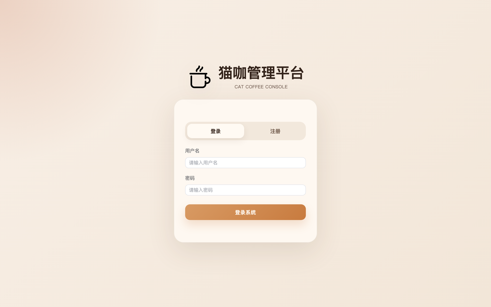
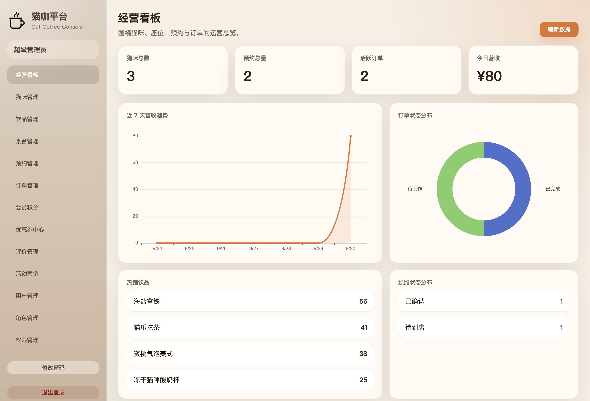
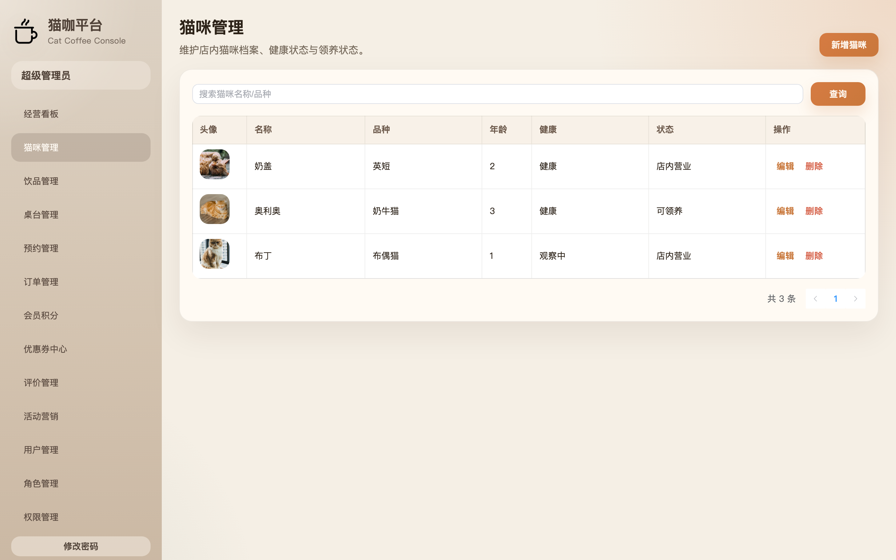
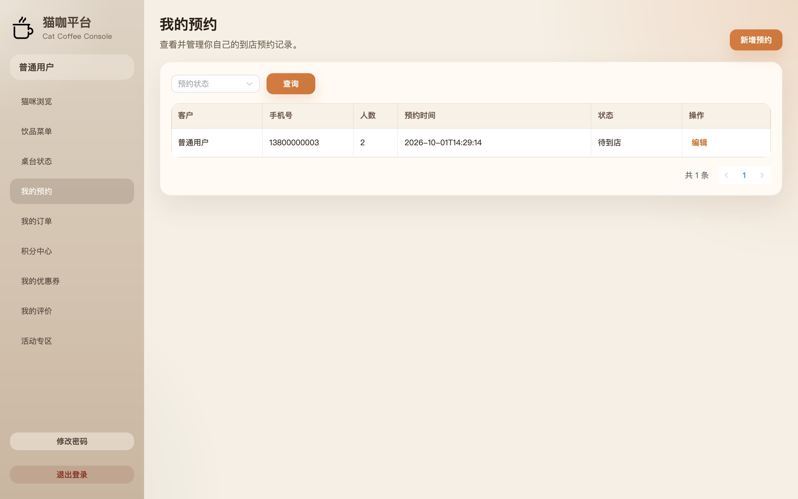
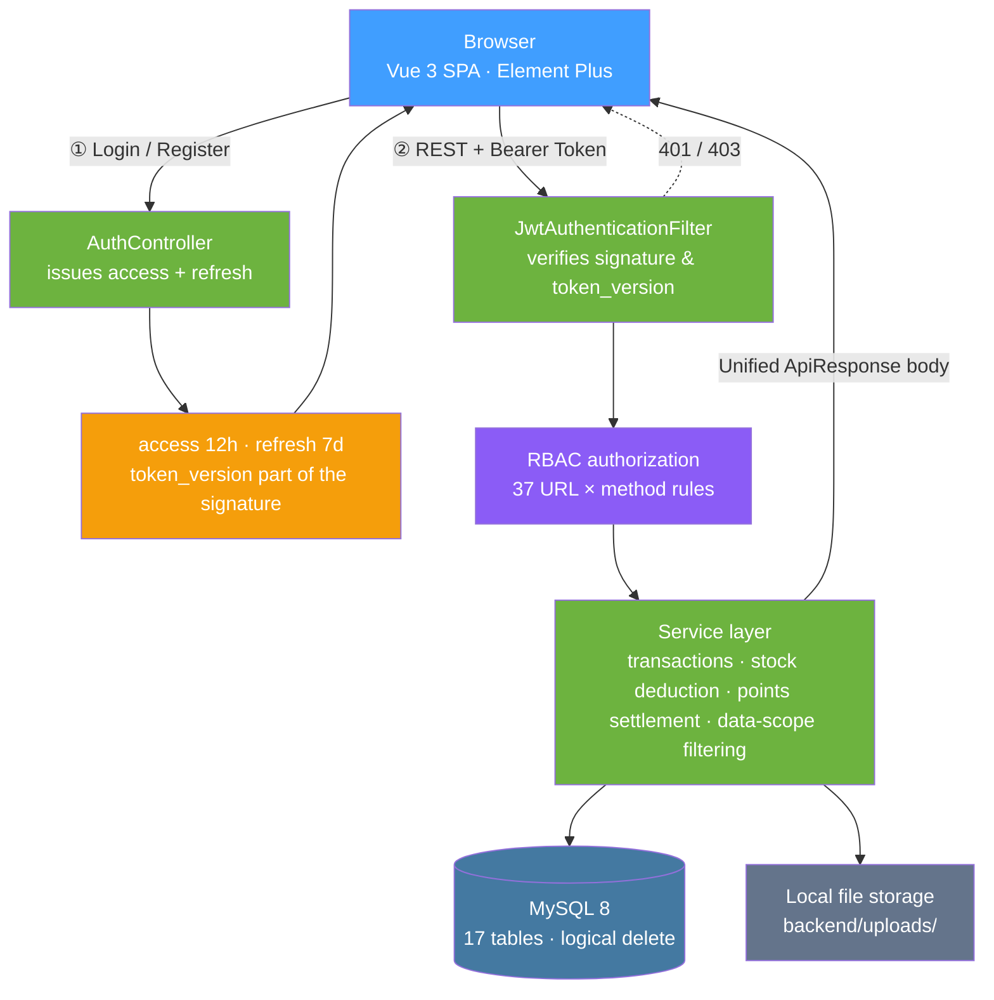
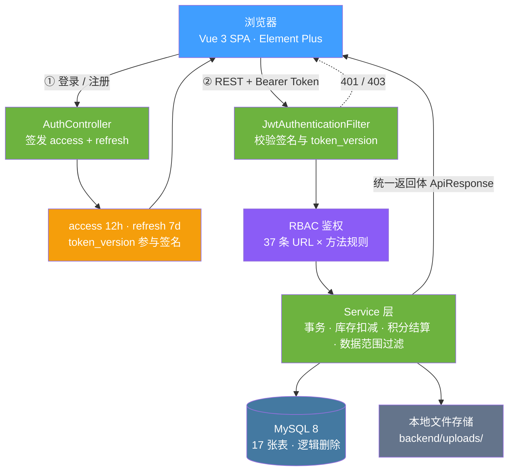

<div align="center">

<picture>
  <source media="(prefers-color-scheme: dark)" srcset="./docs/images/logo-white.png" />
  
</picture>

# 猫咖管理系统

**Cat Coffee Management System**

**面向单店猫咖的经营管理系统。猫咪、饮品、桌台、预约、订单与会员营销在同一个后台里闭环，店员和顾客看到的是同一份数据的两个视角。**

不是换个皮肤的 CRUD 合集。它想验证的是**同一份数据在两种视角下都成立**：门店那边关心的是排期、库存和结算，顾客那边关心的是「我的预约、我的订单、我的积分」。所以猫咪档案、饮品库存、桌台资源、顾客预约和订单流水被串成了一条真正能走通的链路 —— 预约占桌 → 到店下单 → 扣减库存 → 结账送积分 → 积分抵现 → 消费后评价；而管理员、店员、普通用户三种身份在这条链路上各自只能看到被允许看到的那一段。

[更新日志](./CHANGELOG.md) &nbsp;·&nbsp; [数据库脚本](./sql/cat_coffee.sql) &nbsp;·&nbsp; [接口契约](#api-契约) &nbsp;·&nbsp; [免责与说明](#免责与说明license)

[](backend/pom.xml)
[](frontend/package.json)
[](frontend/package.json)
[](sql/cat_coffee.sql)
[](#权限模型)
[](#测试)
[](#测试)

</div>

<details>
<summary><b>English</b>（点击展开英文版 · Click to expand）</summary>

<div align="center">

<picture>
  <source media="(prefers-color-scheme: dark)" srcset="./docs/images/logo-white.png" />
  
</picture>

# Cat Coffee Management System

**Cat Coffee Management System**

**A business management system for single-store cat cafés. Cats, drinks, tables, reservations, orders, and membership marketing all close the loop in one admin console — staff and customers see two views of the same data.**

This is not a CRUD collection with a new skin. What it sets out to prove is that **the same data holds up under two perspectives**: the store side cares about scheduling, inventory, and settlement, while the customer side cares about "my reservations, my orders, my points." So cat profiles, drink inventory, table resources, customer reservations, and order flows are wired into a chain that actually works end to end — reserve a table → order on arrival → deduct inventory → check out and earn points → redeem points for cash credit → review after consumption; and of the three roles — admin, staff, regular user — each can only see the segment of that chain they are allowed to see.

[Changelog](./CHANGELOG.md) &nbsp;·&nbsp; [Database script](./sql/cat_coffee.sql) &nbsp;·&nbsp; [API Contract](#api-contract) &nbsp;·&nbsp; [Disclaimer & Notes](#license)

[](backend/pom.xml)
[](frontend/package.json)
[](frontend/package.json)
[](sql/cat_coffee.sql)
[](#permission-model)
[](#testing)
[](#testing)

</div>

---

## Preview

<table>
<tr>
<td colspan="2" align="center"></td>
</tr>
<tr>
<td colspan="2" align="center"><sub><b>Login page</b> · Login / register dual mode</sub></td>
</tr>
<tr>
<td colspan="2" align="center"></td>
</tr>
<tr>
<td colspan="2" align="center"><sub><b>Business dashboard</b> · 7-day revenue trend and order distribution</sub></td>
</tr>
<tr>
<td colspan="2" align="center"></td>
</tr>
<tr>
<td colspan="2" align="center"><sub><b>Cat management</b> · Admin view, full profiles and in-store status</sub></td>
</tr>
<tr>
<td colspan="2" align="center"></td>
</tr>
<tr>
<td colspan="2" align="center"><sub><b>My reservations</b> · Customer view, only their own reservations</sub></td>
</tr>
</table>

> The four screenshots, top to bottom, were taken from a real run on my machine, untouched. The last two are renderings of
> **the same set of APIs and the same table** under two roles: the admin sees all cat profiles and in-store status, while the
> customer sees only their own reservations — the difference is not in the page, but in the data scope and menu
> visibility (see [Permission Model](#permission-model)).

---

## Features

### 🐾 Three resources, one flowing chain

A cat café's business constraints differ from ordinary F&B: **each cat is itself a "table" that can be occupied**, and tables have a capacity limit.

- **Cat profiles**: breed, age, health status, personality tags, adoption status, feeding cost, birthday, and bio, with avatar upload;
- **Drink menu**: category, price, stock, sales, featured slot, and on/off-shelf status, with image upload;
- **Table resources**: table number, area, capacity, status, and notes;
- **The chain**: reservation (pick time / table / party size) → arrive → order (walk-in order or one linked to a reservation) → auto-totals and **deducts drink inventory** → checkout grants points → points and coupons offset the next order → after consumption, the customer can review **specific drink items**.

An order's original price, discount amount, amount due, points spent, points earned, and linked coupon are stored separately. Merging them into a single `amount` field looks clean, but once you need to trace "why was this order 18 yuan cheaper," you'll never be able to answer.

### 🎫 Membership marketing is not a bolt-on

Points, coupons, reviews, and activities are four tables plus one flow ledger — not four isolated pages:

| Capability | Where the data lands | How it couples with the business |
|---|---|---|
| Points | `sys_user.member_points` + `member_point_flow` ledger | Granted on ordering, deducted on redemption; balance and ledger always reconcile |
| Coupons | `coupon_template` + `user_coupon` | A closed loop of three states: claim / targeted grant from admin / redeem at checkout |
| Reviews | `order_review` | Attached to the **specific drink item** in an order, not a single star slapped on the whole order |
| Activities | `marketing_activity` + `marketing_activity_rule` | Validity period and rules configurable; frontend filters by per-user visibility |

### 🔐 Permission changes take effect immediately

Making the frontend refresh after a permission change is useless — the old token still carries the old permissions, signed inside it. So every user gets a `token_version`, which **participates in the JWT signature and is verified on every request**: role changes, permission assignment changes, and user role adjustments all bump the affected users' `token_version`, invalidating their old tokens on the spot; the frontend's next request gets a 401 and bounces back to the login page.

The cost is that such operations force the affected users to log in again. That's a deliberate trade-off — better to make one person log in once more than to leave a gap where "the page already shows the new permissions, but the API still lets requests through under the old ones."

### 🖥️ One codebase, two frontends

The admin console and the customer-facing frontend are not two projects — they are two views carved out of **the same route table + the same set of APIs** based on the permissions the current account holds:

- Menus render by permission; "My Reservations" and "Reservation Management" point to the same `ReservationView`, differing only in the data scope the server returns and the fields exposed in the form;
- A regular user's landing page after login is not `/dashboard`, but the first accessible page picked by `getHomePath()` based on actual permissions — so the three roles land on three different home pages;
- Form fields are trimmed by role too: when a regular user submits a reservation, backend fields like "customer name" and "internal notes" aren't visible — the server fills those in from the login session.

### 🎨 Visual details are not an afterthought

Alignment, contrast, hover colors — when these go wrong they all look like "minor blemishes," but the root cause often isn't the styling itself (see items 4, 6, and 7 in the next section). So what gets measured here is **pixels and contrast ratios**, not "looks about right":

- Icon-to-title alignment is back-computed from **ink** (the glyph's actual covered area); error at all four breakpoints is `0.00px`;
- Status pills are capsule-shaped with wrapping disabled; contrast calibrated to the WCAG body-text standard (`4.60:1` / `4.79:1`);
- The input focus ring uses the project's warm brown `#c9783c` instead of Element Plus's default `#409EFF` — the latter manages only `2.78:1` against white, **below even the 3:1 required for non-text elements**.

---

## Engineering Notes: Pitfalls We Hit

The backend is roughly 4,900 lines of Java and the frontend roughly 3,800 lines of Vue/JS, but a considerable share of the rework went into places that **look unimportant yet can be fatal**. Every item below was genuinely hit:

<table>
<tr><th width="30%">Symptom</th><th width="70%">Root cause & fix</th></tr>
<tr>
<td><b>Regular user refreshes a restricted page and the URL just spins in place</b></td>
<td>The root route was hardcoded to <code>{ path: '/', redirect: '/dashboard' }</code>. A regular user has no <code>dashboard:view</code>, so the guard bounces them back to <code>/</code>, and <code>/</code> redirects to <code>/dashboard</code> — a <b>dead loop</b>. Symptom: the address bar doesn't move, the page keeps popping "no permission to view this page" while the content is completely empty.<br/><b>This bug cannot be caught by testing with <code>router.push()</code></b>: on client-side navigation, <code>from</code> is the real previous page, the guard happens to land back on the original page, and the problem is fully masked; only a full-page hard refresh exposes it.<br/>The fix is to change <code>/</code> to <code>redirect: () =&gt; getHomePath()</code> resolved per role, plus a fallback on the rejection branch: if the landing page itself is denied, clear the login state and return to the login page. Lesson: <b>route guards must be tested both ways — client-side navigation AND full-page refresh</b>.</td>
</tr>
<tr>
<td><b>Login works on <code>localhost:5173</code> but 403 on <code>127.0.0.1:5173</code></b></td>
<td>The CORS whitelist only listed <code>http://localhost:5173</code>. <b>In the browser's eyes, <code>localhost</code> and <code>127.0.0.1</code> are two different Origins</b> — visiting via the other spelling is cross-origin, and the login endpoint returns <code>403 Invalid CORS request</code> directly. After switching to a comma-separated multi-origin config, both spellings pass, and non-whitelisted origins still get 403.</td>
</tr>
<tr>
<td><b>The order's settlement status is decided by the client</b></td>
<td>The create/update endpoints copied <code>payStatus</code> / <code>orderStatus</code> straight from the request body into the entity — the frontend only had to sneak in two extra fields to bypass the cashier logic and mark the order "paid" itself.<br/>The fix is to <b>let the server decide the initial status</b>, and only allow the admin side to explicitly advance along existing states. <b>This class of vulnerability doesn't error out, doesn't crash — it just quietly miscounts the money.</b></td>
</tr>
<tr>
<td><b>A patch of pale blue in the login box that won't wash out</b></td>
<td>Pixel sampling revealed <b>two different blues layered together</b>: the fill color <code>#E8F0FE</code> is Chrome's autofill background, and the border line <code>#409EFF</code> is Element Plus's focus ring. The project CSS contains no blue at all.<br/>The autofill layer comes with <code>!important</code>; you can't cover it with <code>background-color</code> — the only way is to smother it with a giant inset box shadow <code>0 0 0 1000px #fff inset</code> and take over the text color. The focus ring comes from <code>--el-input-focus-border-color</code>, and <b>this variable is defined on the component class, not on <code>:root</code></b> — writing it on <code>:root</code> gets overridden by the component's own definition, so you must override it at the same level.<br/>⚠️ A related trap: autofill <b>cannot be reproduced in a brand-new browser profile</b> (no saved passwords, nothing triggers), so "I can't see it locally" doesn't mean it isn't there.</td>
</tr>
<tr>
<td><b>Leftover English everywhere: pagination says <code>Total 3</code>, confirm dialog buttons say <code>OK / Cancel</code></b></td>
<td><code>app.use(ElementPlus)</code> in <code>main.js</code> was called without a locale pack, so components silently fell back to the English default. After wiring in the official <code>zh-cn</code> locale, it became "共 3 条" and "确定 / 取消". <b>You can't spot this by statically reading the code</b> — what text a component displays depends entirely on whether a locale is injected at runtime; you have to actually run it and look.</td>
</tr>
<tr>
<td><b>The coupons page gets ~98px of horizontal scrolling at 1440 width</b></td>
<td>The page's own styles weren't wrong — the culprit was the <code>.panel-grid</code> (<code>1.4fr 1fr</code>) it uses. <b>Grid items default to <code>min-width: auto</code></b>, so the first column got pushed to 952px by the minimum width of the <code>el-table</code> inside it, widening the whole grid and overflowing the page. Adding <code>min-width: 0</code> to the grid items brought the columns back to 646 / 462.<br/>What makes this trap special is that <b>the symptom shows up on one page while the root cause lives in a shared layout class</b> — if you only stare at the page that's broken, you'll never fix it.</td>
</tr>
<tr>
<td><b>The icon and the text just won't align</b></td>
<td>"Alignment" has two definitions. The first attempt was <b>equal box heights</b> (both the icon box and the text column set to 46.2px), yet the measured ink was still off by <code>-0.08 / -0.09px</code> — because images carry whitespace and text has line height; equal boxes do not mean equal strokes.<br/>The correct approach is to back-compute from <b>ink</b>: measure that the logo PNG's ink covers only <code>89.625%</code> of its box height and the two lines of text have a total ink height of <code>40.26px</code>, so icon box height = <code>40.26 / 0.89625 = 44.92px</code>; then change the container from <code>align-items: center</code> to letting the text column stretch across the same height with <code>space-between</code>. Error at all four breakpoints, top and bottom, is <code>0.00px</code>.<br/>Also, forcing the icon up to 46.2px doesn't work either — the text is only two lines, leaving a 28px gap in the middle.</td>
</tr>
<tr>
<td><b>The freshly started frontend and backend die the moment you turn around</b></td>
<td>A process started with <code>nohup npm run dev &amp;</code> hangs off the tool's background shell, and <b>when the shell ends it reaps its child processes with it</b>. Start it as a long-lived task instead. When debugging, check ports before digging through logs — when nothing is listening on the port, the logs usually say nothing at all, and reading them is just wasted time.</td>
</tr>
<tr>
<td><b>The Java service was set to 8080 but comes up on some other port</b></td>
<td>The environment had a <code>SERVER__PORT</code> variable; Spring Boot's relaxed binding treats it as <code>server.port</code>, with higher priority than the config file. Strip it before starting with <code>env -u SERVER__PORT</code>, otherwise the frontend throws a pile of cryptic errors from cross-origin / connection failures.</td>
</tr>
</table>

---

## Architecture



### Permission Model

The same set of permission codes gates at **three layers**, so any single layer failing doesn't leak data:

| Layer | Location | Role |
|---|---|---|
| Menu | `App.vue` | Menu items without permission aren't rendered; users never see entries they can't enter |
| Route | `router/index.js` | Hand-typed URLs or full-page refreshes are intercepted by the guard and bounced to the landing page |
| API | 37 `hasAuthority` rules in `SecurityConfig` | **Even if the frontend is bypassed, the server never returns data** |

All three layers use the same set of permission codes (`cat:read` / `order:write` / `system:role:delete` … 32 in total), so there is no in-between state where "the menu hides it but the API doesn't guard it."

### Data Scope

Roles only decide "what you can do"; **data scope is additionally filtered by ownership**: the reservation and order endpoints for regular users forcibly append a `user_id = current logged-in user` condition at the Service layer, instead of trusting filter parameters from the frontend. So on the same `/api/v1/orders` endpoint, the admin sees the whole store's transactions while a regular user sees only their own orders.

---

## Tech Stack

| | |
|---|---|
| Backend | Spring Boot 3.3.4 · Spring Security · MyBatis-Plus 3.5.7 · Spring Validation · Springdoc OpenAPI |
| Auth | JJWT 0.12.6 — Access Token 12h + Refresh Token 7d, `token_version` part of the signature |
| Database | MySQL 8 (17 tables; MyBatis-Plus logical delete — deleting only sets `deleted = 1`) |
| Frontend | Vue 3.5 · Vue Router 4 · Axios · Element Plus 2.8 (with the `zh-cn` locale wired in) |
| Charts | ECharts 5.6 (revenue trend, order status distribution) |
| Build | Vite 4 (frontend) / Maven + JDK 17 (backend) |
| File storage | Local implementation, abstracted at the interface layer, with OSS / MinIO / COS extension points reserved |

---

## Quick Start

### 1. Initialize the database

```bash
mysql -uroot -p --default-character-set=utf8mb4 < sql/cat_coffee.sql
```

> ⚠️ **You must pass `--default-character-set=utf8mb4`**. Importing with the default charset throws no error, but the Chinese nicknames in the seed data turn into mojibake —
> and it's only visible in the UI; the SQL itself looks perfectly fine.

The script creates the `cat_coffee` database and 17 tables, and seeds three roles, 32 permissions, and sample business data.

### 2. Start the backend

The database connection lives in `backend/src/main/resources/application.yml` (default `root` / `123456` / `localhost:3306`).

```bash
cd backend
mvn spring-boot:run          # → http://localhost:8080
```

Swagger for live API debugging: [http://localhost:8080/swagger-ui.html](http://localhost:8080/swagger-ui.html)

> If a `SERVER__PORT` variable exists in your environment, remember to start with `env -u SERVER__PORT mvn spring-boot:run`, otherwise Spring Boot's
> relaxed binding will treat it as `server.port` and the service won't listen on 8080.

### 3. Start the frontend

```bash
cd frontend
npm install
npm run dev                  # → http://127.0.0.1:5173
```

Production build check:

```bash
cd frontend && npm run build
```

---

## Default Accounts

| Role | Username | Password | What they can see |
|---|---|---|---|
| Super admin | `admin` | `admin123` | All menus and full data, incl. user / role / permission management |
| Staff | `staff` | `staff123` | Cats, drinks, tables, reservations, orders, marketing; **no system management** |
| Regular user | `user` | `user123` | My reservations, my orders, points center, my coupons, my reviews, activity zone |

> The landing page after a successful login isn't hardcoded: `getHomePath()` picks the first accessible page based on the permissions the current account actually holds.
> So with the same codebase, the three roles land on three different home pages.

---

## Testing

One round of verification was run on a real machine before delivery, covering build, APIs, permission boundaries, and layout:

| Check | Scope | Result |
|---|---|---|
| Backend compile & package | `mvn -B package -DskipTests` | ✅ Pass |
| Frontend production build | `npm run build` | ✅ Pass |
| API smoke test | 17 endpoints across auth / business / marketing / system | ✅ **17 / 17** business code 200 |
| CORS | Both `localhost` and `127.0.0.1` origins allowed + non-whitelisted origin rejected | ✅ former allowed, latter 403 |
| Auth negative cases | No token / forged token / wrong password | ✅ 401 / 401 / 400 respectively |
| Write-operation loop | Table "create → blocked on missing fields → edit → delete → confirm cleared" | ✅ Full flow passes with no leftover data |
| Role permission boundaries | admin / staff / user × 5 representative endpoints | ✅ Matches design (management endpoints 403 for the latter two) |
| Page horizontal overflow | **13 pages × 5 viewport sizes = 65 checks** | ✅ **0 overflows** |
| Console errors | 13 pages | ✅ 0 errors |

> **Honest disclosure**: the above was manual + scripted verification on a real machine before delivery, **not yet solidified into repeatable automated test cases** — which is why this document offers no
> `npm test`-style command. If this project is to be maintained, two things should be added first: backend tests via `spring-boot-starter-test`
> covering the Service layer's stock deduction and points settlement, and a Playwright suite pinning down the "role × route" permission matrix on the frontend —
> the redirect dead loop in item 1 of the table above is exactly the kind of bug only end-to-end tests can catch.

---

## Directory Structure

```text
Cat-Coffee-Management-System
├── backend/                              # Spring Boot 3 backend
│   └── src/main/java/com/catcoffee/backend/
│       ├── config/                       # SecurityConfig (37 auth rules), CORS, storage config
│       ├── controller/                   # Auth · Cat · Drink · CafeTable · Reservation · Order
│       │                                 # · Dashboard · Marketing · System · File
│       ├── service/                      # Service layer: stock deduction, points settlement, data-scope filtering
│       ├── security/                     # JWT filter, token_version check, 401/403 handlers
│       ├── entity/ mapper/ dto/          # Entities, Mappers, request / response objects
│       └── exception/                    # Global exception handling & unified ApiResponse body
├── frontend/                             # Vue 3 frontend
│   ├── src/
│   │   ├── views/                        # 14 pages (incl. login page)
│   │   ├── router/index.js               # Route table + permission guard + per-role home path resolution
│   │   ├── api/                          # Axios wrapper & per-module API calls
│   │   ├── utils/auth.js                 # Login state, permission checks, home path resolution
│   │   ├── App.vue                       # Sidebar shell & permission-rendered menu
│   │   └── styles.css                    # Global / sidebar / login styles (single source of truth)
│   └── public/                           # Favicons (7 sizes: ico + png), brand images
├── sql/cat_coffee.sql                    # DB init script: 17 tables + roles / permissions / sample data
├── docs/
│   ├── images/                           # README brand images (incl. dark-theme version)
│   └── screenshots/                      # README preview screenshots
├── CHANGELOG.md
└── README.md
```

---

## API Contract

### Unified response body

Every endpoint (including errors) returns the same structure; the frontend interceptor only trusts `code`:

```json
{
  "code": 200,
  "message": "success",
  "data": {}
}
```

Business exceptions are converted by the global exception handler; auth failures are converted by `RestAuthenticationEntryPoint` / `RestAccessDeniedHandler` — so **401 / 403 come back in this structure too, not as Spring Security's default HTML error page**.

### Pagination convention

All list endpoints uniformly support `current` (default 1) and `size` (default 10):

```json
{
  "code": 200,
  "message": "success",
  "data": { "current": 1, "size": 10, "total": 3, "records": [] }
}
```

### Auth endpoints `/api/v1/auth`

| Method | Path | Description | Permission |
|---|---|---|---|
| POST | `/login` | Login by username, returns `accessToken` + `refreshToken` + user info | Public |
| POST | `/register` | Regular user registration, auto-assigns the default role and logs in directly | Public |
| POST | `/refresh` | Exchange a refresh token for a new access token | Public |
| GET | `/me` | Current user info (roles, permissions, member points) | Any logged-in user |
| POST | `/password/change` | Change own password | Any logged-in user |

### Business endpoints

| Module | Path prefix | Permission codes |
|---|---|---|
| Business dashboard | `/api/v1/dashboard` | `dashboard:view` |
| Cat management | `/api/v1/cats` | `cat:read` / `cat:write` / `cat:delete` |
| Drink management | `/api/v1/drinks` | `drink:read` / `drink:write` / `drink:delete` |
| Table management | `/api/v1/tables` | `table:read` / `table:write` / `table:delete` |
| Reservation management | `/api/v1/reservations` | `reservation:read` / `reservation:write` / `reservation:delete` |
| Order management | `/api/v1/orders` | `order:read` / `order:write` / `order:delete` |
| Membership marketing | `/api/v1/marketing/points`, `/coupons`, `/reviews`, `/activities` | `points:read`, `coupon:*`, `review:*`, `activity:*` |
| System management | `/api/v1/system/users`, `/roles`, `/permissions` | `system:user:*`, `system:role:*`, `system:permission:*` |

> Under each path prefix, `GET / POST / DELETE` map to the `read` / `write` / `delete` permission codes respectively;
> for the full rule set see [`SecurityConfig.java`](backend/src/main/java/com/catcoffee/backend/config/SecurityConfig.java).

---

## Quality Boundaries

**Handled**

- Dual-token auto-renewal: an expired access token is silently refreshed by the frontend interceptor, invisible to the user; only a failed refresh returns to the login page.
- Permission changes take effect immediately: `token_version` participates in the signature, so changing permissions voids old login sessions with no gap in between.
- Three-layer, single-source authorization: menu, routes, and APIs share the same set of permission codes — no "hidden in the frontend but unguarded at the API."
- Data scope is forcibly filtered server-side, never trusted to frontend parameters.
- Order settlement status is controlled by the server; clients cannot forge payment results.
- Stock deduction, points settlement, and coupon redemption complete within a single transaction.
- Fully localized Chinese UI copy (including Element Plus pagination and confirm dialogs).
- 0 horizontal overflows across 13 pages × 5 viewport sizes; icons aligned to text by ink with 0.00px error.

**Still improvable**

- **Tests not solidified**: this round of verification was manual + scripted, with no repeatable test cases left behind (see [Testing](#testing)).
- **File storage is a local implementation**: `backend/uploads/` works for local demos but production needs object storage; the interface layer is abstracted, so the change is confined to one implementation class of `StorageService`.
- **No rate limiting or login protection**: no login-attempt limits, captchas, or API rate limits.
- **Marketing activities aren't fully closed-loop**: activity rules are configurable and visible on the frontend, but signup, notifications, and a points mall are still missing.
- **Sidebar selected-state contrast is insufficient**: the selected item is a light-brown background with near-white text, measured at about **2.08:1**, below the WCAG body-text requirement of 4.5:1 (inherited from the original design, left unchanged). Switching to dark brown text would reach 4.54:1.
- **Tables need internal scrolling on narrow screens**: mobile uses a responsive drawer navigation, but wide tables still scroll horizontally rather than collapse into cards.
- **JWT secret and database credentials are written directly in `application.yml`**: fine for local demos, but should be externalized as environment variables when deploying.

---

## Documentation

- [Changelog](./CHANGELOG.md)
- [Database script sql/cat_coffee.sql](./sql/cat_coffee.sql)
- Swagger live API docs: `http://localhost:8080/swagger-ui.html` (start the backend first)

## License

This project is intended for learning, coursework, and portfolio showcase purposes; no open-source license file is attached. For any other use, please contact the author first.

<div align="center"><sub>
The project logo uses the "Hot Chocolate" icon from <a href="https://icons8.com">Icons8</a> under its free license (the source SVG is a paid format; the repo contains the native PNG bitmap, not redrawn as vectors).<br/>
UI screenshots were taken from a real run on my machine and contain no real customer data.
</sub></div>
</details>

---

## 预览

<table>
<tr>
<td colspan="2" align="center"></td>
</tr>
<tr>
<td colspan="2" align="center"><sub><b>登录页</b> · 登录 / 注册双模式</sub></td>
</tr>
<tr>
<td colspan="2" align="center"></td>
</tr>
<tr>
<td colspan="2" align="center"><sub><b>经营看板</b> · 近 7 天营收趋势与订单分布</sub></td>
</tr>
<tr>
<td colspan="2" align="center"></td>
</tr>
<tr>
<td colspan="2" align="center"><sub><b>猫咪管理</b> · 管理员视角，全量档案与在店状态</sub></td>
</tr>
<tr>
<td colspan="2" align="center"></td>
</tr>
<tr>
<td colspan="2" align="center"><sub><b>我的预约</b> · 顾客视角，只能看到自己的预约</sub></td>
</tr>
</table>

> 四张图自上而下依次取自本机实机运行，未经修饰。后两张是**同一套接口、同一张表**在两种角色下的
> 渲染结果：管理员看到全量猫咪档案与在店状态，顾客只看到自己的预约 —— 差别不在页面，
> 而在数据范围与菜单可见性（见[权限模型](#权限模型)）。

---

## 特性

### 🐾 三份资源，一条流转链路

猫咖的业务约束和普通餐饮不一样：**猫本身就是一张会被占用的「桌」**，而桌台是有容量上限的。

- **猫咪档案**：品种、年龄、健康状态、性格标签、领养状态、喂养成本、生日与介绍，可上传头像；
- **饮品菜单**：分类、售价、库存、销量、推荐位与上下架状态，可上传图片；
- **桌台资源**：桌号、区域、容量、状态与备注；
- **链路**：预约（选时间 / 桌台 / 人数）→ 到店 → 下单（散客单或关联预约单）→ 自动汇总金额并**扣减饮品库存** → 结账发放积分 → 积分与优惠券在下一单抵扣 → 消费后可对**具体饮品项**发起评价。

订单里的原价、优惠金额、应付金额、使用积分、奖励积分、关联优惠券是分开存的。合并成一个 `amount` 字段看着干净，但一旦要追溯「这单为什么便宜了 18 块」就再也说不清了。

### 🎫 会员营销不是外挂

积分、优惠券、评价、活动是四张表加一条流水，而不是四个独立的页面：

| 能力 | 数据落点 | 与业务的耦合点 |
|---|---|---|
| 积分 | `sys_user.member_points` + `member_point_flow` 流水 | 下单即发放，抵扣即扣减，余额与流水永远对得上 |
| 优惠券 | `coupon_template` + `user_coupon` | 领取 / 后台定向发放 / 下单核销三态闭环 |
| 评价 | `order_review` | 归属到订单里的**具体饮品项**，而不是整单打个星 |
| 活动 | `marketing_activity` + `marketing_activity_rule` | 有效期与规则可配，前台按用户可见性过滤 |

### 🔐 权限改完即刻生效

改完权限只让前端刷新是没用的 —— 旧 token 里还签着旧权限。这里给每个用户维护一个 `token_version`，**它参与 JWT 签名并在每次请求时校验**：角色变更、权限分配变更、用户角色调整都会让受影响用户的 `token_version` 前进一步，旧 token 当场失效，前端下一次请求即被 401 拦下并跳回登录页。

代价是这类操作会强制对应用户重新登录。这是刻意的取舍 —— 宁可让一个人重新登一次，也不要留下「页面已经变成新权限，接口还按旧权限放行」的缝。

### 🖥️ 一套代码两个端

后台管理和顾客前台不是两个项目，而是**同一套路由表 + 同一套接口**按当前账号持有的权限裁剪出来的两个视图：

- 菜单按权限渲染，「我的预约」和「预约管理」指向同一个 `ReservationView`，差别只在服务端返回的数据范围与表单里暴露的字段；
- 普通用户登录后落地页不是 `/dashboard`，而是 `getHomePath()` 按实际权限挑出的第一个可进页面 —— 所以三种角色登录后落在三个不同的首页；
- 表单字段也按角色裁剪：普通用户提交预约时看不到「客户姓名」「内部备注」这类后台字段，服务端从登录态补齐。

### 🎨 视觉细节不是事后补丁

对齐、对比度、悬停色这些事，出问题的时候看起来都像「小瑕疵」，但根因往往不在样式本身（见下一节第 4、6、7 条）。所以这里量的是**像素和对比度**，不是「看着差不多」：

- 图标与标题的对齐按**墨迹**（字形实际覆盖区域）反算，四个断点误差均为 `0.00px`；
- 状态标记胶囊化并禁止折行，对比度按 WCAG 正文标准校准（`4.60:1` / `4.79:1`）；
- 输入框聚焦环用项目暖棕 `#c9783c`，而不是 Element Plus 默认的 `#409EFF` —— 后者对白底只有 `2.78:1`，**连非文本元素要求的 3:1 都不到**。

---

## 工程笔记：那些踩过的坑

这个项目后端约 4,900 行 Java、前端约 3,800 行 Vue/JS，但相当一部分返工花在了**看起来不重要、实际会要命的地方**。以下每一条都是真实踩过的：

<table>
<tr><th width="30%">症状</th><th width="70%">根因与解法</th></tr>
<tr>
<td><b>普通用户刷新受限页面，URL 卡在那儿转</b></td>
<td>根路由写死了 <code>{ path: '/', redirect: '/dashboard' }</code>。普通用户没有 <code>dashboard:view</code>，守卫拒绝后跳回 <code>/</code>，<code>/</code> 又重定向到 <code>/dashboard</code> —— <b>死循环</b>。表现是地址栏不动、页面反复弹「没有访问该页面的权限」而内容全空。<br/><b>这个 bug 用 <code>router.push()</code> 测不出来</b>：客户端跳转时 <code>from</code> 是真实的上一页，守卫恰好能落回原页，问题被完整掩盖；只有整页硬刷新才会暴露。<br/>修法是把 <code>/</code> 改成 <code>redirect: () =&gt; getHomePath()</code> 按角色解析，并给拒绝分支加一条兜底：落地页本身就被拒时清登录态回登录页。教训：<b>路由守卫必须用「客户端跳转」和「整页刷新」两种方式各测一遍</b>。</td>
</tr>
<tr>
<td><b><code>localhost:5173</code> 能登录，<code>127.0.0.1:5173</code> 报 403</b></td>
<td>CORS 白名单只配了 <code>http://localhost:5173</code>。<b>在浏览器眼里 <code>localhost</code> 和 <code>127.0.0.1</code> 是两个不同的 Origin</b>，换种写法访问就是跨域，登录接口直接 <code>403 Invalid CORS request</code>。改成逗号分隔的多来源配置后两种写法都放行，非白名单来源仍然 403。</td>
</tr>
<tr>
<td><b>订单的结算状态，客户端说了算</b></td>
<td>新增/编辑接口直接把请求体里的 <code>payStatus</code> / <code>orderStatus</code> 拷进实体 —— 前端只要多带两个字段就能绕过收银逻辑，自己把单子标成「已支付」。<br/>修法是<b>由服务端决定初始状态</b>，管理端只允许沿既有状态显式推进。<b>这类漏洞不会报错、不会崩，只会安静地算错账。</b></td>
</tr>
<tr>
<td><b>登录框里一块洗不掉的淡蓝</b></td>
<td>采样像素后发现是<b>两层不同的蓝</b>叠在一起：填充色 <code>#E8F0FE</code> 是 Chrome 自动填充的底色，边线 <code>#409EFF</code> 是 Element Plus 的聚焦环。项目 CSS 里其实一处蓝都没有。<br/>自动填充那层带 <code>!important</code>，用 <code>background-color</code> 盖不掉，只能拿一个 <code>0 0 0 1000px #fff inset</code> 的巨型内阴影压住并接管文字色；聚焦环来自 <code>--el-input-focus-border-color</code>，<b>这个变量定义在组件类上而不在 <code>:root</code></b>，写 <code>:root</code> 会被组件自身定义压掉，必须在同层覆盖。<br/>⚠️ 顺带一个坑：自动填充在<b>全新浏览器 profile 里复现不出来</b>（没有保存过密码就不触发），「我本地看不到」不代表没问题。</td>
</tr>
<tr>
<td><b>全站英文残留：分页写 <code>Total 3</code>，确认框按钮写 <code>OK / Cancel</code></b></td>
<td><code>main.js</code> 里 <code>app.use(ElementPlus)</code> 没传语言包，组件静默回落到英文默认。挂上官方 <code>zh-cn</code> 后变成「共 3 条」「确定 / 取消」。<b>这个问题静态读代码看不出来</b> —— 组件显示什么文案完全取决于运行时有没有注入 locale，必须真跑起来看。</td>
</tr>
<tr>
<td><b>优惠券页在 1440 宽度下多出约 98px 横向滚动</b></td>
<td>不是这一页的样式写错了，是它用的 <code>.panel-grid</code>（<code>1.4fr 1fr</code>）出的问题。<b>grid 子项默认 <code>min-width: auto</code></b>，第一列被里面 <code>el-table</code> 的最小宽度顶到 952px，把整条网格撑宽、溢出页面。给网格子项补 <code>min-width: 0</code> 后列回到 646 / 462。<br/>这个坑的特点是<b>症状出现在某一页，根因却在通用布局类上</b> —— 只盯着出问题的那页改，永远改不对。</td>
</tr>
<tr>
<td><b>图标和文字怎么都对不齐</b></td>
<td>「对齐」有两种口径。先做的是<b>盒子等高</b>（图标盒和文字列都设成 46.2px），测出来墨迹仍然差 <code>-0.08 / -0.09px</code> —— 因为图片自带留白、文字有行高，盒子等高不等于笔画等高。<br/>正确做法是按 <b>墨迹</b> 反算：量出 logo PNG 的墨迹只占盒高 <code>89.625%</code>，两行文字的墨迹总高 <code>40.26px</code>，于是图标盒高 = <code>40.26 / 0.89625 = 44.92px</code>，再把容器从 <code>align-items: center</code> 换成让文字列 <code>space-between</code> 撑满同一高度。四个断点上下沿误差均为 <code>0.00px</code>。<br/>另外，把图标硬撑到 46.2px 也不行 —— 文字只有两行，会在中间多出 28px 空档。</td>
</tr>
<tr>
<td><b>刚启动的前后端，转个身就全挂了</b></td>
<td>用 <code>nohup npm run dev &amp;</code> 起的进程挂在工具的后台 shell 下，<b>shell 结束时会把子进程一起回收</b>。要按常驻任务的方式起。排查时先看端口再翻日志 —— 端口没人监听时，日志里通常什么都不写，翻日志只会浪费时间。</td>
</tr>
<tr>
<td><b>Java 服务指定了 8080，起来却在别的端口</b></td>
<td>环境里存在 <code>SERVER__PORT</code> 变量，Spring Boot 的 relaxed binding 会把它当成 <code>server.port</code>，且优先级高于配置文件。启动前要 <code>env -u SERVER__PORT</code> 把它摘掉，否则前端会因为跨域 / 连不上而报一堆看不懂的错。</td>
</tr>
</table>

---

## 架构



### 权限模型

同一套权限码在**三个层次**上各拦一道，任何一层单独失守都不至于漏数据：

| 层 | 位置 | 作用 |
|---|---|---|
| 菜单 | `App.vue` | 无权限的菜单项不渲染，用户不会看到进不去的入口 |
| 路由 | `router/index.js` | 手敲 URL 或整页刷新会被守卫拦回落地页 |
| 接口 | `SecurityConfig` 的 37 条 `hasAuthority` 规则 | **即使前端被绕过，服务端也不会返回数据** |

三层用的是同一组权限码（`cat:read` / `order:write` / `system:role:delete` …共 32 个），不存在「菜单藏了但接口没管」的中间态。

### 数据范围

角色只决定「能做什么」，**数据范围另外按归属过滤**：普通用户的预约与订单接口在 Service 层强制附加 `user_id = 当前登录用户` 条件，而不是把过滤交给前端传参。所以同一个 `/api/v1/orders` 接口，管理员看到的是全店流水，普通用户看到的是自己的单子。

---

## 技术栈

| | |
|---|---|
| 后端 | Spring Boot 3.3.4 · Spring Security · MyBatis-Plus 3.5.7 · Spring Validation · Springdoc OpenAPI |
| 认证 | JJWT 0.12.6 —— Access Token 12h + Refresh Token 7d，`token_version` 参与签名 |
| 数据库 | MySQL 8（17 张表；MyBatis-Plus 逻辑删除，删除只置 `deleted = 1`） |
| 前端 | Vue 3.5 · Vue Router 4 · Axios · Element Plus 2.8（已挂 `zh-cn` 语言包） |
| 图表 | ECharts 5.6（营收趋势、订单状态分布） |
| 构建 | Vite 4（前端） / Maven + JDK 17（后端） |
| 文件存储 | 本地实现，接口层已抽象，预留 OSS / MinIO / COS 扩展位 |

---

## 快速开始

### 1. 初始化数据库

```bash
mysql -uroot -p --default-character-set=utf8mb4 < sql/cat_coffee.sql
```

> ⚠️ **必须带 `--default-character-set=utf8mb4`**。用默认字符集导入不会报错，但初始化数据里的中文昵称会变成乱码 ——
> 而且只在界面上看得出来，SQL 里完全正常。

脚本会建库 `cat_coffee`、17 张表，并写入三类角色、32 个权限与示例业务数据。

### 2. 启动后端

数据库连接在 `backend/src/main/resources/application.yml`（默认 `root` / `123456` / `localhost:3306`）。

```bash
cd backend
mvn spring-boot:run          # → http://localhost:8080
```

Swagger 在线调试：[http://localhost:8080/swagger-ui.html](http://localhost:8080/swagger-ui.html)

> 如果环境里存在 `SERVER__PORT`，记得用 `env -u SERVER__PORT mvn spring-boot:run` 启动，否则 Spring Boot 的
> relaxed binding 会把它当作 `server.port`，服务不会监听在 8080。

### 3. 启动前端

```bash
cd frontend
npm install
npm run dev                  # → http://127.0.0.1:5173
```

生产构建检查：

```bash
cd frontend && npm run build
```

---

## 默认账号

| 角色 | 账号 | 密码 | 能看到什么 |
|---|---|---|---|
| 超级管理员 | `admin` | `admin123` | 全部菜单与全量数据，含用户 / 角色 / 权限管理 |
| 店员 | `staff` | `staff123` | 猫咪、饮品、桌台、预约、订单、营销；**无系统管理** |
| 普通用户 | `user` | `user123` | 我的预约、我的订单、积分中心、我的优惠券、我的评价、活动专区 |

> 登录成功后落地页不是写死的：`getHomePath()` 按当前账号实际持有的权限挑第一个能进的页面。
> 所以同一套代码，三种角色登录后看到的是三个不同的首页。

---

## 测试

交付前在本机实机跑过一轮，覆盖构建、接口、权限边界与布局：

| 检查项 | 规模 | 结果 |
|---|---|---|
| 后端编译打包 | `mvn -B package -DskipTests` | ✅ 通过 |
| 前端生产构建 | `npm run build` | ✅ 通过 |
| 接口冒烟 | 认证 / 业务 / 营销 / 系统共 17 个端点 | ✅ **17 / 17** 业务码 200 |
| CORS | `localhost` 与 `127.0.0.1` 双 Origin 放行 + 非白名单 Origin 拒绝 | ✅ 前者放行、后者 403 |
| 鉴权负例 | 无 token / 伪造 token / 错误密码 | ✅ 分别 401 / 401 / 400 |
| 写操作闭环 | 桌台「新增 → 缺字段被拦 → 编辑 → 删除 → 确认已清空」 | ✅ 全流程通过且无残留数据 |
| 角色权限边界 | admin / staff / user × 5 个代表接口 | ✅ 与设计一致（管理接口对后者 403） |
| 页面横向溢出 | **13 个页面 × 5 档视口 = 65 项** | ✅ **0 项溢出** |
| 控制台报错 | 13 个页面 | ✅ 0 条 |

> **诚实说明**：以上是交付前的人工 + 脚本实机验证，**尚未固化成可重复运行的自动化用例**，因此本文档不提供
> `npm test` 之类的命令。如果这个项目要继续维护，建议优先补两件事：后端用 `spring-boot-starter-test`
> 覆盖 Service 层的库存扣减与积分结算，前端用 Playwright 把「角色 × 路由」的权限矩阵钉住 ——
> 上面第 1 条那个重定向死循环，正是只有端到端测试才抓得住的类型。

---

## 目录结构

```text
Cat-Coffee-Management-System
├── backend/                              # Spring Boot 3 后端
│   └── src/main/java/com/catcoffee/backend/
│       ├── config/                       # SecurityConfig（37 条鉴权规则）、CORS、存储配置
│       ├── controller/                   # Auth · Cat · Drink · CafeTable · Reservation · Order
│       │                                 # · Dashboard · Marketing · System · File
│       ├── service/                      # 业务层：库存扣减、积分结算、数据范围过滤
│       ├── security/                     # JWT 过滤器、token_version 校验、401/403 处理器
│       ├── entity/ mapper/ dto/          # 实体、Mapper、请求 / 响应对象
│       └── exception/                    # 统一异常处理与统一返回体 ApiResponse
├── frontend/                             # Vue 3 前端
│   ├── src/
│   │   ├── views/                        # 14 个页面（含登录页）
│   │   ├── router/index.js               # 路由表 + 权限守卫 + 按角色解析落地页
│   │   ├── api/                          # Axios 封装与各模块接口
│   │   ├── utils/auth.js                 # 登录态、权限判断、落地页解析
│   │   ├── App.vue                       # 侧栏壳层与按权限渲染的菜单
│   │   └── styles.css                    # 全局 / 侧栏 / 登录页样式（唯一来源）
│   └── public/                           # favicon（七档 ico + png）、品牌图
├── sql/cat_coffee.sql                    # 建库脚本：17 张表 + 角色 / 权限 / 示例数据
├── docs/
│   ├── images/                           # README 品牌图（含深色主题版）
│   └── screenshots/                      # README 预览图
├── CHANGELOG.md
└── README.md
```

---

## API 契约

### 统一返回体

所有接口（含异常）都返回同一结构，前端拦截器只认 `code`：

```json
{
  "code": 200,
  "message": "success",
  "data": {}
}
```

业务异常由全局异常处理器转换，鉴权失败由 `RestAuthenticationEntryPoint` / `RestAccessDeniedHandler` 转换 —— 所以 **401 / 403 也是这个结构，而不是 Spring Security 默认的 HTML 错误页**。

### 分页约定

所有列表接口统一支持 `current`（默认 1）与 `size`（默认 10）：

```json
{
  "code": 200,
  "message": "success",
  "data": { "current": 1, "size": 10, "total": 3, "records": [] }
}
```

### 认证中心 `/api/v1/auth`

| 方法 | 路径 | 说明 | 权限 |
|---|---|---|---|
| POST | `/login` | 账号登录，返回 `accessToken` + `refreshToken` + 用户信息 | 公开 |
| POST | `/register` | 普通用户注册，自动分配默认角色并直接登录 | 公开 |
| POST | `/refresh` | 用 refresh token 换新 access token | 公开 |
| GET | `/me` | 当前用户信息（含角色、权限、会员积分） | 登录即可 |
| POST | `/password/change` | 修改本人密码 | 登录即可 |

### 业务接口

| 模块 | 路径前缀 | 权限码 |
|---|---|---|
| 经营看板 | `/api/v1/dashboard` | `dashboard:view` |
| 猫咪管理 | `/api/v1/cats` | `cat:read` / `cat:write` / `cat:delete` |
| 饮品管理 | `/api/v1/drinks` | `drink:read` / `drink:write` / `drink:delete` |
| 桌台管理 | `/api/v1/tables` | `table:read` / `table:write` / `table:delete` |
| 预约管理 | `/api/v1/reservations` | `reservation:read` / `reservation:write` / `reservation:delete` |
| 订单管理 | `/api/v1/orders` | `order:read` / `order:write` / `order:delete` |
| 会员营销 | `/api/v1/marketing/points`、`/coupons`、`/reviews`、`/activities` | `points:read`、`coupon:*`、`review:*`、`activity:*` |
| 系统管理 | `/api/v1/system/users`、`/roles`、`/permissions` | `system:user:*`、`system:role:*`、`system:permission:*` |

> 每个路径前缀下的 `GET / POST / DELETE` 分别对应 `read` / `write` / `delete` 三个权限码，
> 完整规则见 [`SecurityConfig.java`](backend/src/main/java/com/catcoffee/backend/config/SecurityConfig.java)。

---

## 质量边界

**已处理**

- 双令牌自动续期：access token 过期由前端拦截器静默刷新，用户无感；刷新失败才回登录页。
- 权限变更即刻生效：`token_version` 参与签名，改权限即让旧登录态作废，不留割裂窗口。
- 三层同源鉴权：菜单、路由、接口用同一组权限码，不存在「前端藏了、接口没管」。
- 数据范围由服务端强制过滤，不依赖前端传参。
- 订单结算状态由服务端掌控，客户端无法伪造支付结果。
- 库存扣减、积分结算、优惠券核销在同一事务内完成。
- 全站中文文案（含 Element Plus 组件的分页与确认框）。
- 13 个页面 × 5 档视口的横向溢出为 0；图标与文字按墨迹对齐，误差 0.00px。

**仍可增强**

- **测试未固化**：本轮验证靠人工 + 脚本，没有沉淀成可重复运行的用例（见[测试](#测试)）。
- **文件存储是本地实现**：`backend/uploads/` 适合本地演示，上线需切对象存储；接口层已抽象，改动集中在 `StorageService` 的一个实现类。
- **缺少限流与登录保护**：没有登录失败次数限制、验证码或接口速率限制。
- **营销活动未闭环**：活动规则可配、前台可见，但还没有报名、消息通知与积分商城。
- **侧栏选中态对比度不足**：选中项是浅棕底 + 近白字，实测对比度约 **2.08:1**，低于 WCAG 正文要求的 4.5:1（原始设计自带，未改动）。改成深棕字即可达 4.54:1。
- **窄屏下表格需内部滚动**：移动端为响应式抽屉导航，但宽表格本身仍是横向滚动而不是卡片化。
- **JWT 密钥与数据库口令直接写在 `application.yml`**：本地演示够用，部署时应外置为环境变量。

---

## 文档

- [更新日志 CHANGELOG](./CHANGELOG.md)
- [数据库脚本 sql/cat_coffee.sql](./sql/cat_coffee.sql)
- Swagger 在线接口文档：`http://localhost:8080/swagger-ui.html`（需先启动后端）

## 免责与说明（License）

本项目用于学习、课程设计与作品集展示场景，未附开源协议文件；如需用于其它用途请先联系作者。

<div align="center"><sub>
项目 Logo 采用 <a href="https://icons8.com">Icons8</a> 的「热可可」图标，遵循其免费许可（源 SVG 为付费格式，仓库内为原生 PNG 位图，未做矢量化重绘）。<br/>
界面截图取自本机实机运行，未包含任何真实顾客数据。
</sub></div>
